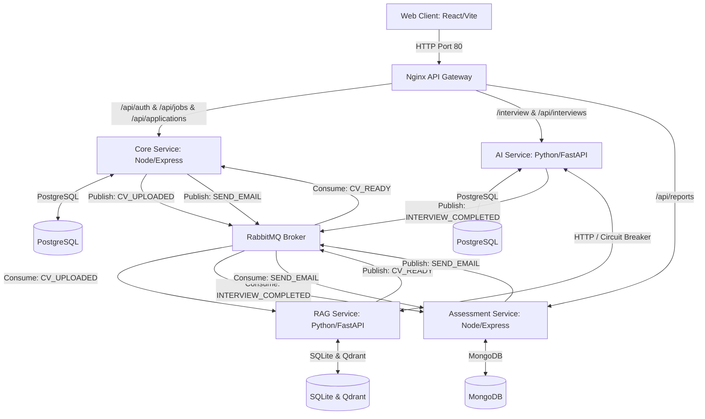

# AI HR Recruiter — Intelligent Recruitment Platform

AI HR Recruiter is an enterprise-grade, intelligent recruitment platform built on a distributed microservices architecture. It automates first-round screening: HR users create job descriptions and upload candidate resumes, an AI agent conducts structured, contextual interviews tailored to the candidate's CV and job requirements, and an LLM-based assessment service generates scored feedback reports with precise citations.

---

## 🏗 System Architecture

The platform consists of five primary components communicating via HTTP/REST (synchronous) and RabbitMQ (asynchronous).



### Asynchronous Event Contracts (RabbitMQ)

1. **`CV_UPLOADED`**: Published by *Core Service* when HR submits a candidate CV. Consumed by *RAG Service* to extract raw text and save semantic vector embeddings.
2. **`CV_READY`**: Published by *RAG Service* after extraction and name/email parsing. Consumed by *Core Service* to update candidate application metadata and transition the status to `READY_FOR_INTERVIEW`.
3. **`INTERVIEW_COMPLETED`**: Published by *AI Service* when the interview ends (outro reached or manually closed). Consumed by *Assessment Service* to initiate grading.
4. **`SEND_EMAIL`**: Published by *Core* (invites) and *Assessment* (reports). Consumed by *Assessment Service* to send mock SMTP email notifications.

---

## 🛠 Tech Stack Summary

| Service | Technology / Framework | Primary Purpose | Port (Internal) |
|---|---|---|---|
| **Web Client** | React, Vite, TypeScript, Vanilla CSS | HR Dashboard & Candidate Interview interface | `3000` |
| **API Gateway** | Nginx | Reverse proxy, SSL termination, and rate-limiting (100 r/m) | `80` (Host) |
| **Core Service** | Node.js, Express, TypeScript, Prisma | Authentication, Job Posting CRUD, Application status | `3001` |
| **AI Service** | Python, FastAPI, LangGraph | Interview flow control state machine | `3002` |
| **RAG Service** | Python, FastAPI, pdfplumber, Qdrant | PDF resume parsing, indexing, and context extraction | `3003` |
| **Assessment Service** | Node.js, Express, TypeScript, Mongoose | Grading, scoring logic, mock email dispatch | `3004` |

---

## 🚀 Quick Start Guide

### Prerequisites
- [Docker](https://www.docker.com/) and [Docker Compose](https://docs.google.com/compose/)
- Node.js (v20+) & Python (v3.12) for local development/unit testing

### Startup Procedures
1. **Clone the Repository** and navigate to the project directory:
   ```bash
   cd /Users/admin/01_Projects/Microservice
   ```
2. **Configure Environment Variables**:
   Create a `.env` file in the root directory (based on `.env.example`):
   ```bash
   cp .env.example .env
   ```
3. **Start the Stack**:
   Spin up all microservices and databases in detached mode:
   ```bash
   docker compose up -d --build
   ```
4. **Verify Health**:
   All 10 containers (including monitoring tools) should show `healthy`:
   ```bash
   docker compose ps
   ```

---

## 📋 Environment Variables Reference

Below are the primary configuration variables required in the root `.env` file:

| Variable | Description | Default / Example |
|---|---|---|
| `GEMINI_API_KEY` | Gemini LLM API Key (Required for AI chat & Assessment scoring) | *Your Gemini API Key* |
| `JWT_SECRET` | Secret key used to sign Auth tokens | `test-jwt-secret-for-development` |
| `POSTGRES_PASSWORD` | Password for core & AI PostgreSQL instances | `postgres_secure_pwd` |
| `RABBITMQ_DEFAULT_PASS` | Password for the RabbitMQ message broker | `rabbitmq_secure_pwd` |
| `MONITORING_GF_SECURITY_ADMIN_PASSWORD` | Password for Grafana dashboard | `grafana_secure_pwd` |
| `SMTP_PASS` | Password for outgoing email alerts | `smtp_secure_pwd` |

---

## 📖 API Documentation

Each microservice exposes a detailed OpenAPI specification saved under the `docs/` directory:

- **Core Service**: [docs/openapi_core_service.json](file:///Users/admin/01_Projects/Microservice/docs/openapi_core_service.json) (Auth, Jobs, Applications)
- **AI Service**: [docs/openapi_ai_service.json](file:///Users/admin/01_Projects/Microservice/docs/openapi_ai_service.json) (Interview Sessions, Live Chat)
- **Assessment Service**: [docs/openapi_assessment_service.json](file:///Users/admin/01_Projects/Microservice/docs/openapi_assessment_service.json) (Report Retrieval)

A pre-configured Postman Collection is also available for manual API testing and local verification:
- [docs/api.postman_collection.json](file:///Users/admin/01_Projects/Microservice/docs/api.postman_collection.json)

---

## 🧪 Testing Guide

The system includes comprehensive unit, integration, and automated end-to-end (E2E) regression suites.

### 1. Automated E2E Regression Test
To run a complete simulation of the recruitment process (HR registration -> Login -> Job creation -> CV Upload -> Async RAG parsing -> Magic Link verification -> Interview chat -> Session ending -> Assessment report generation):
```bash
python3 scratch/run_e2e.py
```

### 2. Running Microservice Unit & Integration Tests
You can run test suites locally on the host machine:

#### Core Service
```bash
cd core-service && npm install && npm test
```

#### Assessment Service
```bash
cd assessment-service && npm install && npm test
```

#### AI Service
```bash
cd ai-service && PYTHONPATH=. .venv/bin/pytest tests
```

#### RAG Service
```bash
cd rag-service && PYTHONPATH=. .venv/bin/pytest tests
```

---

## 📈 Monitoring & Observability

The system incorporates Prometheus, Grafana, and Loki for real-time monitoring and unified logging.
- **Prometheus** (`http://localhost:9090`): Monitors system metrics.
- **Grafana** (`http://localhost:3000`): Visualizes performance dashboards. Default credentials: `admin` / `admin`.
- **Loki**: Aggregates container logs in JSON format with correlation IDs to track requests across services.
