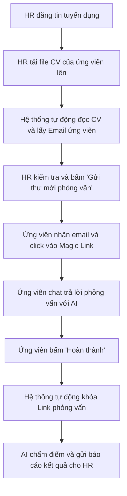

# HƯỚNG DẪN SỬ DỤNG HỆ THỐNG AI HR RECRUITER

Chào mừng bạn đến với **AI HR Recruiter** – Nền tảng tuyển dụng thông minh hỗ trợ Nhà tuyển dụng (HR) tự động hóa quy trình sàng lọc hồ sơ và phỏng vấn sơ loại (Vòng 1) thông qua Trợ lý ảo AI.

Tài liệu này được viết dưới góc độ người dùng thông thường để giúp bạn dễ dàng hiểu các tính năng và cách thức hoạt động của hệ thống.

---

## 1. AI HR Recruiter giải quyết bài toán gì?

Thông thường, quy trình tuyển dụng tốn rất nhiều thời gian của HR ở khâu:
*   Đọc và phân loại hàng trăm CV.
*   Đặt lịch và gọi điện phỏng vấn sơ loại (vòng gửi xe) để đánh giá thái độ, giao tiếp và kỹ năng cơ bản.
*   Gửi email thông báo kết quả.

**AI HR Recruiter tự động hóa toàn bộ quá trình này:**
1.  HR chỉ cần tải CV của ứng viên lên.
2.  Hệ thống tự động đọc thông tin (Tên, Email) trong CV.
3.  HR duyệt và bấm gửi thư mời phỏng vấn tự động.
4.  Ứng viên nhận được link và thực hiện chat phỏng vấn trực tiếp với AI.
5.  AI tự động chấm điểm, nhận xét và gửi báo cáo kết quả chi tiết cho HR.

---

## 2. Các tính năng chính của hệ thống

Hệ thống phục vụ hai nhóm đối tượng chính với các chức năng tương ứng:

### Đối với Nhà Tuyển Dụng (HR)
*   **Đăng ký & Đăng nhập:** HR tạo tài khoản riêng để quản lý các chiến dịch tuyển dụng của công ty.
*   **Quản lý Tin tuyển dụng (Job):** HR đăng thông tin vị trí cần tuyển (Tên vị trí, mô tả công việc - JD, yêu cầu kỹ năng).
*   **Tải lên CV (Upload CV):** HR kéo thả/tải lên file CV (dạng PDF) của ứng viên ứng tuyển vào vị trí tương ứng.
*   **Trích xuất thông tin tự động:** Hệ thống tự động đọc CV và tìm ra Tên cũng như Email của ứng viên để HR không phải nhập tay.
*   **Gửi thư mời phỏng vấn chỉ với 1 Click:** HR bấm nút gửi lời mời, hệ thống tự động soạn email chứa một **Đường dẫn phỏng vấn duy nhất (Magic Link)** gửi tới hòm thư của ứng viên.
*   **Xem báo cáo đánh giá từ AI:** Sau khi ứng viên hoàn thành trả lời phỏng vấn, HR sẽ nhận được báo cáo chấm điểm chi tiết về:
    *   *Điểm chuyên môn (Technical Score)*
    *   *Điểm giao tiếp (Communication Score)*
    *   *Mức độ phù hợp với công việc (Relevance Score)*
    *   *Tóm tắt điểm mạnh, điểm yếu và đề xuất của AI (Có nên đưa vào vòng tiếp theo hay không).*

### Đối với Ứng viên (Candidate)
*   **Không cần tạo tài khoản:** Ứng viên không cần thực hiện các bước đăng ký tài khoản hay đăng nhập phức tạp.
*   **Phòng phỏng vấn riêng tư (Magic Link):** Chỉ cần click vào đường dẫn nhận được trong email là ứng viên có thể vào thẳng phòng chat phỏng vấn với AI.
*   **Hỗ trợ sự cố mạng (Resume Session):** Nếu đang phỏng vấn mà bị mất mạng hoặc vô tình tắt trình duyệt, ứng viên chỉ cần bấm lại vào link email cũ là có thể tiếp tục trả lời câu hỏi mà không bị mất dữ liệu trước đó.
*   **Tự động khóa link:** Sau khi ứng viên nhấn nút **"Hoàn thành phỏng vấn"**, đường dẫn đó sẽ bị vô hiệu hóa vĩnh viễn để đảm bảo tính công bằng (tránh việc ứng viên quay lại sửa câu trả lời hoặc làm lại bài).

---

## 3. Luồng hoạt động chi tiết (Step-by-Step)

Dưới đây là hành trình của một quy trình tuyển dụng diễn ra trên hệ thống:

### Bước 1: HR tạo vị trí tuyển dụng
HR nhập các thông tin mô tả công việc (JD) cho một vị trí, ví dụ: "Lập trình viên Backend Node.js".

### Bước 2: HR tải CV lên hệ thống
Khi nhận được CV từ các nguồn (như Vietnamworks, TopCV, Email cá nhân...), HR tải file CV đó lên hệ thống dưới vị trí công việc tương ứng. 
*Hệ thống sẽ chuyển trạng thái của hồ sơ này sang: **Đang xử lý**.*

### Bước 3: Hệ thống trích xuất thông tin
Trong vòng vài giây, hệ thống sẽ tự động quét nội dung CV để tìm Email và Tên của ứng viên. 
*Hệ thống chuyển trạng thái sang: **Sẵn sàng mời phỏng vấn**.*
*(Nếu CV viết bằng định dạng lạ khiến hệ thống không quét được email, HR có thể tự tay điền bổ sung).*

### Bước 4: HR gửi lời mời phỏng vấn
HR xem danh sách các CV đã quét xong và chọn những ứng viên phù hợp, sau đó bấm nút **"Gửi thư mời"**. Hệ thống tự động tạo mã phòng phỏng vấn bí mật và gửi email cho ứng viên.
*Hệ thống chuyển trạng thái sang: **Đã gửi thư mời**.*

### Bước 5: Ứng viên tham gia phỏng vấn
Ứng viên mở email, click vào link được gửi kèm. Giao diện chat hiện ra, Trợ lý AI sẽ chào đón ứng viên và lần lượt đưa ra các câu hỏi phỏng vấn theo các giai đoạn:
1.  **Chào hỏi & Giới thiệu.**
2.  **Hỏi về kinh nghiệm làm việc** (AI sẽ dựa trên thông tin trong CV để hỏi).
3.  **Hỏi về chuyên môn/kỹ thuật** (AI dựa trên yêu cầu công việc của JD).
4.  **Hỏi về tình huống thực tế.**
5.  **Kết thúc & Cảm ơn.**

### Bước 6: Hoàn thành và Chấm điểm
Khi ứng viên trả lời hết các câu hỏi và bấm **"Hoàn thành"**, hệ thống sẽ khóa phòng chat này lại. Đồng thời, hệ thống thông báo cho dịch vụ Đánh giá tiến hành chấm điểm cuộc hội thoại.

### Bước 7: HR nhận kết quả
Hệ thống gửi email thông báo cho HR rằng ứng viên đã hoàn thành. HR truy cập vào trang quản trị để đọc bảng điểm và đưa ra quyết định tuyển dụng cuối cùng.
