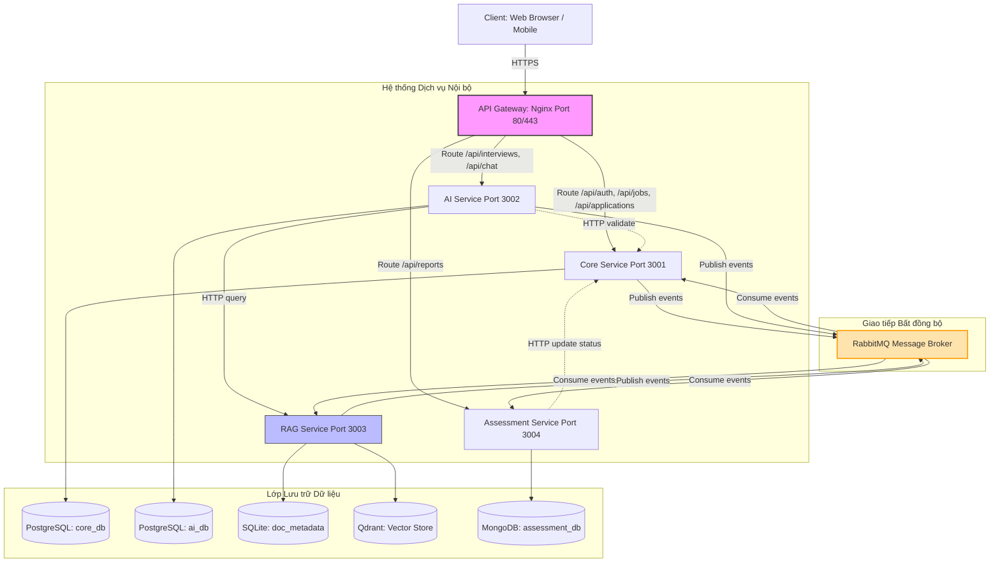
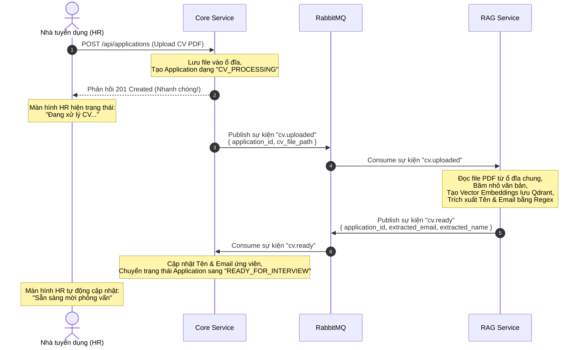

# PHẦN 1: KIẾN TRÚC MICROSERVICES - HỆ THỐNG AI HR RECRUITER

Chào mừng các bạn thành viên trong đội ngũ phát triển! Tài liệu này sẽ giúp bạn nắm bắt toàn bộ bức tranh kiến trúc hệ thống của dự án **AI HR Recruiter**. 

Nếu bạn đã quen thuộc với việc xây dựng các ứng dụng web dạng đơn khối (Monolith) như một server Node.js/Express hay Django/Python duy nhất chứa cả API, logic nghiệp vụ và kết nối trực tiếp với một database, tài liệu này sẽ dẫn dắt bạn từng bước tiếp cận kiến trúc **Microservices (Vi dịch vụ)** thông qua thực tế dự án của chúng ta.

---

## 1. Giới thiệu về Microservices dưới góc nhìn Web Developer

### 1.1. Monolith (Đơn khối) vs Microservices (Vi dịch vụ)

Trong một ứng dụng **Monolith**, toàn bộ chức năng (quản lý công việc, lưu CV, xử lý AI, gửi mail, quản lý database) đều được đóng gói và chạy chung trong **một process duy nhất**. 

Trong dự án **AI HR Recruiter**, chúng ta chọn kiến trúc **Microservices**. Hệ thống được chia nhỏ thành **4 dịch vụ độc lập**, mỗi dịch vụ chịu trách nhiệm cho một nghiệp vụ duy nhất (Single Responsibility) và chạy trên các container riêng biệt.

#### Bảng so sánh trực quan:

| Tiêu chí | Monolith (Đơn khối) | Microservices (Vi dịch vụ) trong AI HR Recruiter |
| :--- | :--- | :--- |
| **Phân chia mã nguồn** | Chung một repository, tất cả các module nằm chung một thư mục. | Mỗi service có một thư mục riêng biệt (`core-service`, `ai-service`, `rag-service`...), chạy runtime riêng. |
| **Cơ sở dữ liệu** | Một database duy nhất cho toàn bộ hệ thống. | **Database per Service:** Mỗi service sở hữu database riêng (PostgreSQL, MongoDB, SQLite, Qdrant). |
| **Mức độ phụ thuộc** | Lỗi ở một module (ví dụ: tràn bộ nhớ khi đọc file PDF) có thể làm sập toàn bộ server. | Các service hoạt động độc lập. Nếu `assessment-service` lỗi, ứng viên vẫn có thể phỏng vấn bình thường với `ai-service`. |
| **Khả năng mở rộng (Scale)** | Phải scale toàn bộ ứng dụng, gây lãng phí tài nguyên. | Chỉ scale service cần thiết. Ví dụ: Scale `ai-service` lên nhiều container khi có đợt phỏng vấn lớn, giữ nguyên các service khác. |
| **Công nghệ lựa chọn** | Bị giới hạn trong một ngôn ngữ/framework chính. | Linh hoạt chọn công nghệ tối ưu cho từng task (Express/Node.js cho CRUD nhanh, FastAPI/Python cho AI/RAG). |

---

## 2. Thiết kế Kiến trúc Hệ thống AI HR Recruiter

Dưới đây là sơ đồ luồng đi của dữ liệu từ Client qua các lớp hạ tầng đến các service nội bộ:



### 2.1. Vai trò của 4 Dịch vụ chính
1. **Core Service (Node.js/Express/TypeScript + PostgreSQL):** 
   - Quản lý nhà tuyển dụng (HR), đăng nhập/đăng ký.
   - Quản lý các công việc (Jobs) và hồ sơ ứng viên (Applications).
   - Lưu trữ trạng thái của hồ sơ tuyển dụng.
2. **AI Service (Python/FastAPI + PostgreSQL):**
   - Quản lý các phòng chat phỏng vấn trực tiếp giữa Trợ lý AI và Ứng viên.
   - Sử dụng máy trạng thái điều hướng cuộc trò chuyện qua 5 giai đoạn: Chào hỏi -> Hỏi CV -> Hỏi chuyên môn JD -> Tình huống -> Kết thúc.
3. **RAG Service (Python/FastAPI + Qdrant + SQLite):**
   - Phân tích cú pháp file CV (PDF), băm nhỏ văn bản (chunking) và chuyển đổi thành dạng số (embedding).
   - Lưu trữ các vector vào Qdrant để thực hiện tìm kiếm ngữ nghĩa, cung cấp tài liệu tham khảo cho AI.
4. **Assessment Service (Node.js/TypeScript + MongoDB):**
   - Nhận lịch sử chat sau khi kết thúc phỏng vấn để chấm điểm ứng viên.
   - Tổng hợp báo cáo đánh giá chi tiết và gửi email kết quả cho HR.

### 2.2. Tại sao lại dùng mô hình "Database per Service"?
Nếu tất cả các service dùng chung một Database, chúng ta sẽ gặp hiện tượng **Coupling (Ràng buộc chặt)**. Khi một service thay đổi cấu trúc bảng, các service khác sẽ bị lỗi theo.

Trong hệ thống của chúng ta:
- **Core Service** cần tính toàn vẹn dữ liệu cao (ràng buộc khóa ngoại giữa User, Job, Application) nên dùng **PostgreSQL (Quan hệ)**.
- **Assessment Service** lưu trữ các báo cáo đánh giá có cấu trúc linh hoạt (tùy thuộc vào câu hỏi và tiêu chí chấm điểm thay đổi theo thời gian) nên dùng **MongoDB (Tài liệu - Document DB)**.
- **RAG Service** cần tìm kiếm sự tương đồng giữa các đoạn văn bản dựa trên khoảng cách toán học, nên dùng **Qdrant (Vector DB)** kết hợp **SQLite** để lưu metadata gọn nhẹ.

---

## 3. Trái tim Hệ thống: API Gateway (Nginx)

Đối với các hệ thống Microservices, client không bao giờ kết nối trực tiếp đến các cổng nội bộ như `3001`, `3002`, `3004`. Thay vào đó, mọi request đều đi qua một chốt chặn duy nhất gọi là **API Gateway** (chúng ta cấu hình bằng **Nginx** chạy ở cổng `80/443`).

### 3.1. Các nhiệm vụ cốt lõi của API Gateway trong dự án
*   **Định tuyến (Routing):** Khi bạn gửi request tới `https://localhost/api/auth/login`, Nginx sẽ đọc tiền tố `/api/auth` và chuyển tiếp (proxy) yêu cầu đến `core-service:3001`.
*   **Ẩn cấu trúc mạng nội bộ:** Client hoàn toàn không biết `rag-service` nằm ở đâu và chạy ở cổng nào. RAG Service được cấu hình chạy nội bộ và **không được cấu hình route** trên Gateway, giúp bảo mật tuyệt đối các file CV và JD gốc.
*   **Tách biệt Cơ chế Xác thực (Authentication Routing):**
    - **Dành cho HR:** Các API như `/api/jobs` (POST/PUT/DELETE) hoặc `/api/applications` yêu cầu mã JWT được gửi kèm trong Header `Authorization: Bearer <token>`.
    - **Dành cho Ứng viên:** Ứng viên không có tài khoản trên hệ thống. Họ truy cập thông qua một **Magic Link** có dạng `https://localhost/interview/<magic-token>`. Gateway sẽ dẫn hướng route này đến `ai-service:3002`. AI Service sẽ tự xác thực token này với Core Service để cho phép ứng viên chat.

### 3.2. Cấu hình Nginx thực tế và Giải thích

Dưới đây là một phần file cấu hình `api-gateway/nginx.conf` của hệ thống:

```nginx
# 1. Định nghĩa giới hạn tần suất yêu cầu (Rate Limiting) để tránh spam
limit_req_zone $limit_key zone=api_limit:10m rate=100r/m;

server {
    listen 443 ssl;
    server_name localhost;

    # 2. Cơ chế giải quyết DNS động của Docker (CỰC KỲ QUAN TRỌNG)
    resolver 127.0.0.11 valid=10s ipv6=off;

    # Cấu hình chứng chỉ bảo mật SSL
    ssl_certificate /etc/nginx/certs/nginx.crt;
    ssl_certificate_key /etc/nginx/certs/nginx.key;

    # Áp dụng giới hạn Rate Limiting trên toàn hệ thống (tối đa 100 req/phút, burst 50)
    limit_req zone=api_limit burst=50 nodelay;

    # 3. Định tuyến Core Service - Quản lý Đơn ứng tuyển
    location /api/applications {
        # Sử dụng biến $upstream_core thay vì chỉ định cứng host để tránh lỗi DNS cache
        set $upstream_core core-service:3001;
        proxy_pass http://$upstream_core;
        
        proxy_set_header Host $host;
        proxy_set_header X-Real-IP $remote_addr;
        proxy_set_header X-Forwarded-For $proxy_add_x_forwarded_for;
        proxy_set_header X-Correlation-ID $correlation_id; # ID theo dõi luồng log
        
        client_max_body_size 5M; # Cho phép upload CV tối đa 5MB
    }

    # 4. Định tuyến AI Service - Chat Phỏng vấn
    location /api/chat {
        set $upstream_ai ai-service:3002;
        proxy_pass http://$upstream_ai;
        proxy_set_header Host $host;
        proxy_set_header X-Correlation-ID $correlation_id;
    }
    
    # 5. Định tuyến đến Client Web App (React)
    location / {
        set $upstream_web web-client:80;
        proxy_pass http://$upstream_web;
    }
}
```

#### Giải thích các điểm kỹ thuật quan trọng trong file cấu hình:
1.  **`resolver 127.0.0.11 valid=10s;`**: Đây là địa chỉ DNS nội bộ của Docker. Khi chúng ta chạy `docker compose up --build` để cập nhật một dịch vụ, Docker sẽ gán cho container đó một IP nội bộ mới. Nếu không có dòng `resolver` và cách khai báo biến `set $upstream_core`, Nginx sẽ cache IP cũ mãi mãi và trả về lỗi `502 Bad Gateway` khi container restart. Cấu hình này buộc Nginx phải refresh DNS sau mỗi 10 giây.
2.  **`X-Correlation-ID`**: Gateway tự tạo ra một mã định danh duy nhất (UUID) cho mỗi request đi vào hệ thống và đính vào HTTP Header. Mã này sẽ được truyền qua toàn bộ các service giúp lập trình viên lọc log để theo dõi chính xác hành vi của một request duy nhất đi qua nhiều service khác nhau.

---

## 4. Giao tiếp Bất đồng bộ qua RabbitMQ

Trong hệ thống Monolith, khi HR upload CV lên, chương trình sẽ chạy hàm đọc PDF, băm văn bản rồi lưu Database, toàn bộ quá trình mất khoảng 5-10 giây và bắt HR phải chờ trên màn hình với biểu tượng loading. Nếu có 100 CV tải lên cùng lúc, server có thể bị nghẽn và chết.

Để giải quyết vấn đề này, chúng ta sử dụng **Giao tiếp bất đồng bộ hướng sự kiện (Asynchronous Event-Driven)** thông qua **RabbitMQ**.

### 4.1. Luồng xử lý hồ sơ ứng viên (CV Upload & Parse)



Nhờ có luồng xử lý này, HR không phải chờ đợi. Core Service chỉ làm nhiệm vụ lưu file nhanh và giao việc nặng (đọc PDF, AI Embeddings) cho RAG Service thông qua RabbitMQ.

### 4.2. Cấu hình kết nối và Xử lý Lỗi trong RabbitMQ

Để đảm bảo hệ thống không bị mất tin nhắn khi gặp lỗi mạng hoặc sập nguồn, chúng ta phải cấu hình RabbitMQ với các cơ chế phòng vệ mạnh mẽ. 

Dưới đây là mã nguồn cấu hình RabbitMQ trong `core-service/src/events/connection.ts`:

```typescript
import amqplib, { ChannelModel, Channel } from 'amqplib';
import logger from '../utils/logger';

let connection: ChannelModel | null = null;
let channel: Channel | null = null;

export async function connectRabbitMQ(url: string): Promise<Channel> {
  if (channel) return channel;

  try {
    const activeConnection = await amqplib.connect(url);
    connection = activeConnection;
    
    const activeChannel = await activeConnection.createChannel();
    channel = activeChannel;

    // 1. Khai báo các Exchange bền vững (durable: true)
    await activeChannel.assertExchange('cv.events', 'direct', { durable: true });
    await activeChannel.assertExchange('dlx.events', 'direct', { durable: true }); // Dead Letter Exchange

    // 2. Khai báo hàng đợi lỗi (Dead Letter Queue - DLQ)
    await activeChannel.assertQueue('dlq.cv.uploaded', { durable: true });
    await activeChannel.bindQueue('dlq.cv.uploaded', 'dlx.events', 'cv.uploaded');

    // 3. Khai báo hàng đợi chính với cấu hình DLX và thời gian sống (TTL)
    await activeChannel.assertQueue('cv.uploaded', {
      durable: true,
      arguments: {
        'x-dead-letter-exchange': 'dlx.events', // Gửi tin nhắn lỗi sang DLX
        'x-message-ttl': 60000,                  // Tin nhắn chỉ tồn tại tối đa 60 giây trong hàng đợi
      },
    });
    await activeChannel.bindQueue('cv.uploaded', 'cv.events', 'cv.uploaded');

    // 4. Lắng nghe sự kiện mất kết nối để tự động reconnect sau 5 giây
    activeConnection.on('close', () => {
      logger.warn({ event: 'rabbitmq.connection.closed' });
      channel = null;
      connection = null;
      setTimeout(() => connectRabbitMQ(url), 5000); 
    });

    return activeChannel;
  } catch (err) {
    logger.error({ event: 'rabbitmq.connection_failed', error: err });
    // Thử kết nối lại sau 5 giây nếu lần đầu thất bại
    await new Promise((resolve) => setTimeout(resolve, 5000));
    return connectRabbitMQ(url);
  }
}
```

#### Giải thích các cơ chế resilience quan trọng trong code RabbitMQ:
1.  **`durable: true`**: Đảm bảo rằng nếu server RabbitMQ bị restart đột ngột, các Exchange và Queue vẫn tự động phục hồi mà không bị xóa mất dữ liệu.
2.  **`x-dead-letter-exchange (DLX)`**: Khi RAG Service cố gắng xử lý một file CV bị lỗi (ví dụ: file PDF bị hỏng hoặc mã hóa không đọc được), tin nhắn xử lý CV đó sẽ bị từ chối (`reject`/`nack`). Thay vì biến mất hoặc bị lặp đi lặp lại vô hạn làm nghẽn hàng đợi, RabbitMQ sẽ tự chuyển tin nhắn lỗi này sang **Dead Letter Queue (DLQ)** (`dlq.cv.uploaded`) để lập trình viên kiểm tra thủ công.
3.  **Tự động Reconnect (`on('close')`)**: Tránh trường hợp container RabbitMQ khởi động chậm hơn các app service hoặc bị restart đột ngột. Hệ thống sẽ tự động lắng nghe và kết nối lại sau mỗi 5 giây mà không làm sập tiến trình Node.js.

---

## 5. Tóm tắt & Bài học kinh nghiệm cho Web Developer

Khi làm việc trong kiến trúc Microservices của hệ thống AI HR Recruiter, bạn hãy luôn nhớ 3 nguyên tắc vàng:
1.  **Tuyệt đối không truy cập trực tiếp Database của service khác.** Nếu `ai-service` cần kiểm tra trạng thái hồ sơ của ứng viên, nó phải gọi HTTP API đến `core-service` thay vì tự ý kết nối vào database `core_db`.
2.  **Mỗi log ghi ra đều phải đính kèm `correlation_id`.** Điều này giúp bạn dễ dàng tìm lỗi xuyên suốt các service bằng cách tìm kiếm ID tương quan trên hệ thống log tập trung.
3.  **Thiết kế có tính đến khả năng thất bại (Design for Failure).** Hãy luôn bao bọc các lệnh gọi HTTP ngoại vi bằng cơ chế thử lại (retry) hoặc ngắt mạch (circuit breaker) để đảm bảo lỗi ở service này không kéo đổ toàn bộ hệ thống.
