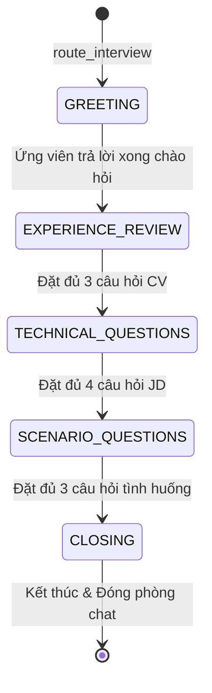

# PHẦN 2: CƠ CHẾ AI & RAG PIPELINE - HỆ THỐNG AI HR RECRUITER

Trong phần này, chúng ta sẽ đi sâu vào "bộ não" của hệ thống **AI HR Recruiter**. Hệ thống không chỉ đơn thuần là nhận tin nhắn và phản hồi, mà nó kết hợp hai công nghệ AI tiên tiến:
1.  **RAG (Retrieval-Augmented Generation - Tạo lập tăng cường truy xuất)** để AI hiểu CV của ứng viên và Mô tả công việc (JD).
2.  **LangGraph (Đồ thị trạng thái hội thoại)** để điều hướng cuộc phỏng vấn đi đúng lộ trình chuyên nghiệp.
3.  **LLM Assessment (Chấm điểm thông minh)** dùng Google Gemini để đánh giá ứng viên khách quan và chống ảo giác (hallucination).

---

## 1. Giới thiệu về RAG & Vector Search

### 1.1. RAG (Retrieval-Augmented Generation) là gì?
Các mô hình ngôn ngữ lớn (LLM) như GPT hay Gemini rất thông minh, nhưng chúng **không biết** ứng viên Nguyễn Văn A là ai, trong CV của họ viết gì, hay doanh nghiệp của bạn đang tuyển vị trí gì với yêu cầu kỹ thuật nào. 

Để giải quyết vấn đề này, thay vì phải train lại (fine-tune) mô hình LLM với chi phí cực kỳ đắt đỏ, chúng ta áp dụng cơ chế **RAG**. Khi AI chuẩn bị đặt câu hỏi hoặc đánh giá ứng viên, nó sẽ chạy một câu truy vấn tìm kiếm nhanh trong cơ sở dữ liệu CV để lấy ra các đoạn thông tin liên quan nhất, sau đó "dán" các thông tin này vào câu lệnh (Prompt) gửi cho LLM.

### 1.2. Quy trình xử lý RAG Pipeline trong `rag-service`

Khi một CV được tải lên, hệ thống thực hiện 4 bước tự động:
1.  **Trích xuất văn bản (Text Extraction):** Dịch vụ `rag-service` dùng thư viện Python (`pdfplumber`) đọc file PDF CV và chuyển thành một chuỗi văn bản thô.
2.  **Chia nhỏ văn bản (Text Splitting):** Một file CV dài không thể gửi toàn bộ vào Vector DB vì sẽ gây loãng thông tin và tốn token. Chúng ta dùng `RecursiveCharacterTextSplitter` chia nhỏ văn bản thành các khối (chunks) khoảng **512 ký tự**, gối đầu lên nhau **50 ký tự** để đảm bảo không mất ngữ cảnh ở ranh giới các đoạn.
3.  **Vector hóa (Embedding generation):** Mỗi đoạn văn bản thô được chạy qua mô hình embedding (mặc định là `all-MiniLM-L6-v2` chạy trực tiếp trên server hoặc OpenAI API) để biến đổi thành một mảng số thực (gọi là vector) đại diện cho ngữ nghĩa của đoạn văn đó.
4.  **Lưu trữ vào Qdrant (Vector DB):** Các vector được lưu vào Qdrant dưới dạng các PointStruct. Mỗi Point chứa tọa độ vector, `application_id` để phân biệt các ứng viên, và `payload` chứa văn bản gốc.

### 1.3. Mã nguồn xử lý Vector trong Qdrant
Dưới đây là cách `rag-service` thực hiện lưu trữ (upsert) và tìm kiếm (search) tương đồng ngữ nghĩa:

```python
# File: rag-service/app/vector_store/qdrant_store.py

from qdrant_client.models import PointStruct, Filter, FieldCondition, MatchValue

class QdrantStore:
    # ... kết nối Qdrant client ...

    def upsert_vectors(self, application_id: str, chunks: list[dict], embeddings: list[list[float]], doc_type: str = "CV"):
        """
        Lưu các đoạn text và vector tương ứng của ứng viên vào Qdrant.
        """
        dimension = len(embeddings[0])
        self.recreate_collection(dimension) # Tạo collection nếu chưa có
        
        points = []
        for idx, (chunk, embedding) in enumerate(zip(chunks, embeddings)):
            point_id = str(uuid.uuid4())
            points.append(PointStruct(
                id=point_id,
                vector=embedding,
                payload={
                    "application_id": application_id,
                    "content": chunk["content"],     # Đoạn text gốc
                    "metadata": chunk["metadata"],   # Số trang, nguồn tài liệu
                    "doc_type": doc_type
                }
            ))
            
        # Đẩy dữ liệu lên Qdrant DB
        self.client.upsert(
            collection_name=self.collection_name,
            points=points
        )

    def search(self, query_text: str, application_id: str, top_k: int = 5) -> list[dict]:
        """
        Tìm kiếm ngữ nghĩa: Nhập câu hỏi thô -> Vector hóa -> Lấy ra các đoạn CV liên quan nhất.
        """
        # 1. Chuyển đổi câu truy vấn thô thành vector
        embedder = get_embedder()
        query_vector = embedder.embed_query(query_text)

        # 2. Tạo bộ lọc (Filter) chỉ tìm kiếm các đoạn thuộc về hồ sơ ứng viên này
        qdrant_filter = Filter(
            must=[
                FieldCondition(
                    key="application_id",
                    match=MatchValue(value=application_id)
                )
            ]
        )
        
        # 3. Thực hiện tìm kiếm khoảng cách Cosine trên Qdrant
        results = self.client.search(
            collection_name=self.collection_name,
            query_vector=query_vector,
            query_filter=qdrant_filter,
            limit=top_k
        )
        
        return [{
            "content": r.payload.get("content"),
            "score": r.score,
            "metadata": r.payload.get("metadata", {})
        } for r in results]
```

---

## 2. Máy Trạng Thái Điều Hướng Hội Thoại (LangGraph)

Khi phỏng vấn ứng viên, nếu chỉ gửi lịch sử chat trực tiếp cho ChatGPT/Gemini, AI sẽ dễ bị lan man, hỏi đi hỏi lại hoặc không biết khi nào cần kết thúc. Để cuộc phỏng vấn có tính cấu trúc như một buổi phỏng vấn ngoài đời thực, chúng ta xây dựng máy trạng thái bằng **LangGraph**.

### 2.1. Đồ thị trạng thái phỏng vấn (StateGraph)

Chúng ta khai báo một đồ thị có 5 nút (Nodes) tương ứng với 5 giai đoạn phỏng vấn:



### 2.2. Mã nguồn xây dựng Đồ thị và Bộ định tuyến (Router)

Cách xây dựng Đồ thị LangGraph và hàm định tuyến chuyển trạng thái:

```python
# File: ai-service/app/graph/builder.py

from langgraph.graph import StateGraph, END
from app.graph.state import InterviewState
# ... import các node ...

def build_interview_graph():
    workflow = StateGraph(InterviewState)
    
    # 1. Đăng ký các Nodes (các bước hội thoại) vào đồ thị
    workflow.add_node("greeting", greeting_node)
    workflow.add_node("experience_review", experience_review_node)
    workflow.add_node("technical_questions", technical_questions_node)
    workflow.add_node("scenario_questions", scenario_questions_node)
    workflow.add_node("closing", closing_node)
    
    # 2. Thiết lập điểm vào kèm theo bộ định tuyến động route_interview
    workflow.set_conditional_entry_point(
        route_interview,
        {
            "greeting": "greeting",
            "experience_review": "experience_review",
            "technical_questions": "technical_questions",
            "scenario_questions": "scenario_questions",
            "closing": "closing",
            END: END
        }
    )
    
    # 3. Cấu hình để sau khi Node chạy xong, luồng đi sẽ trả kết quả về client (END turn)
    for node_name in ["greeting", "experience_review", "technical_questions", "scenario_questions", "closing"]:
        workflow.add_edge(node_name, END)
        
    return workflow.compile()
```

Bộ định tuyến quyết định thời điểm chuyển đổi giai đoạn dựa trên số lượng câu hỏi đã đặt:

```python
# File: ai-service/app/graph/router.py

def route_interview(state: InterviewState) -> str:
    current_stage = state.get("current_stage")
    count = state.get("stage_question_count", 0)
    chat_history = state.get("chat_history") or []
    
    # Đếm số lần ứng viên đã trả lời
    candidate_replies = [msg for msg in chat_history if msg.get("role") == "CANDIDATE"]
    
    if not current_stage:
        return "greeting"
        
    if current_stage == "GREETING":
        if len(candidate_replies) >= 1:
            return "experience_review" # Ứng viên nói câu đầu tiên -> bắt đầu khai thác kinh nghiệm
        return "greeting"
        
    elif current_stage == "EXPERIENCE_REVIEW":
        if count >= 3: # Hỏi đủ 3 câu về CV ứng viên -> chuyển sang hỏi kiến thức JD
            return "technical_questions"
        return "experience_review"
        
    elif current_stage == "TECHNICAL_QUESTIONS":
        if count >= 4: # Hỏi đủ 4 câu chuyên môn -> chuyển sang tình huống thực tế
            return "scenario_questions"
        return "technical_questions"
        
    elif current_stage == "SCENARIO_QUESTIONS":
        if count >= 3: # Hỏi đủ 3 câu tình huống -> kết thúc buổi phỏng vấn
            return "closing"
        return "scenario_questions"
        
    elif current_stage == "CLOSING":
        return END
```

---

## 3. Cơ Chế Chấm Điểm và Nhận Xét (Assessment)

Khi cuộc phỏng vấn kết thúc, một sự kiện `INTERVIEW_COMPLETED` được bắn qua RabbitMQ. `assessment-service` lập tức bắt lấy sự kiện để tạo báo cáo đánh giá.

### 3.1. Chống Ảo Giác AI bằng Xác thực Trích Dẫn (Citation Validation)
Một lỗi rất phổ biến khi dùng AI để chấm điểm là **AI tự nghĩ ra (ảo giác)** các câu trả lời mà ứng viên chưa từng nói để đưa vào báo cáo đánh giá nhằm chứng minh điểm số của mình là đúng.

Để giải quyết triệt để lỗi này, hệ thống của chúng ta thiết kế cơ chế **Citation Validation (Xác thực trích dẫn)**:
1.  Chúng ta yêu cầu Gemini trả về kết quả đánh giá kèm danh sách các trích dẫn nguyên văn (`citations`) chứng minh cho điểm số đó (trường `quote`).
2.  Sau khi nhận JSON từ Gemini, hệ thống tự động kiểm tra xem chuỗi trích dẫn (`quote`) đó **có thực sự tồn tại như một chuỗi con** trong các tin nhắn gốc của ứng viên trong lịch sử chat hay không.
3.  Nếu trích dẫn đó là giả (không khớp), hệ thống sẽ **loại bỏ trích dẫn** đó khỏi báo cáo để HR không bị đọc thông tin sai lệch.

### 3.2. Mã nguồn gọi API Gemini và Xác thực Trích dẫn trong `assessment-service`

Dưới đây là cách `LlmScorer` gọi REST API của Gemini và thực hiện xác thực:

```typescript
// File: assessment-service/src/scoring/llmScorer.ts

import { ChatMessage, ScoringResult } from './scorer';
import logger from '../utils/logger';

export function validateCitations(
  citations: any[],
  chatHistory: ChatMessage[]
): Array<{ quote: string; stage: string; dimension: string }> {
  if (!Array.isArray(citations)) return [];

  // Lấy ra tất cả tin nhắn thực tế của Ứng viên, viết thường và loại bỏ khoảng trắng thừa
  const candidateMessages = chatHistory
    .filter((m) => m.role === 'CANDIDATE')
    .map((m) => m.content.toLowerCase().replace(/\s+/g, ' ').trim());

  return citations
    .filter((cit) => {
      if (!cit || typeof cit !== 'object') return false;
      const quote = (cit.quote || '').toLowerCase().replace(/\s+/g, ' ').trim();
      
      // CHỈ GIỮ LẠI: Trích dẫn của AI phải khớp 100% với một phần tin nhắn của ứng viên
      return quote.length > 0 && candidateMessages.some((msg) => msg.includes(quote));
    })
    .map((cit) => ({
      quote: cit.quote.trim(),
      stage: cit.stage || 'TECHNICAL_QUESTIONS',
      dimension: cit.dimension || 'technical',
    }));
}

export class LlmScorer {
  async score(chatHistory: ChatMessage[], requirementsText?: string): Promise<any> {
    const apiKey = process.env.LLM_API_KEY;
    
    // Gọi API của Gemini bằng phương thức HTTP POST
    const url = `https://generativelanguage.googleapis.com/v1beta/models/gemini-3.5-flash:generateContent?key=${apiKey}`;
    
    const response = await fetch(url, {
      method: 'POST',
      headers: { 'Content-Type': 'application/json' },
      body: JSON.stringify({
        contents: [{
          role: 'user',
          parts: [{ text: `${SYSTEM_PROMPT}\n\n${userPrompt}` }],
        }],
        generationConfig: {
          responseMimeType: 'application/json', // Buộc Gemini trả về JSON đúng cấu trúc
          temperature: 0.2,                     // Giảm tính sáng tạo để điểm số được chuẩn hóa
        },
      }),
    });

    const data = await response.json();
    const jsonText = data?.candidates?.[0]?.content?.parts?.[0]?.text;
    const result = JSON.parse(jsonText);

    // Thực hiện kiểm tra chéo các trích dẫn (Citations)
    const validatedCitations = validateCitations(result.citations || [], chatHistory);

    return {
      scores: result.scores,
      summary: result.summary,
      strengths: result.strengths,
      weaknesses: result.weaknesses,
      recommendation: result.recommendation,
      citations: validatedCitations, // Chỉ chứa các trích dẫn thật 100%
      scoring_method: 'LLM'
    };
  }
}
```

---

## 4. Tóm tắt & Bài học kinh nghiệm cho Web Developer

1.  **Luôn lọc trùng lặp và phân mảnh ngữ cảnh:** RAG rất nhạy cảm với dữ liệu rác. Khi lưu trữ CV, cần thiết kế bộ chia text hợp lý để tránh việc LLM đọc phải các ký tự đặc biệt hoặc mã hex PDF bị lỗi.
2.  **StateGraph là vô giá để kiểm soát hội thoại:** Việc cấu hình cứng số lượng câu hỏi tối đa cho mỗi giai đoạn giúp buổi phỏng vấn tự động kết thúc gọn gàng mà không phụ thuộc vào ý muốn chủ quan của AI.
3.  **JSON Mode của LLM:** Khi gọi các service AI, hãy bật cấu hình `responseMimeType: 'application/json'`. Điều này giúp code Node.js/Python dễ dàng parse kết quả mà không sợ lỗi định dạng text do LLM sinh ra.
