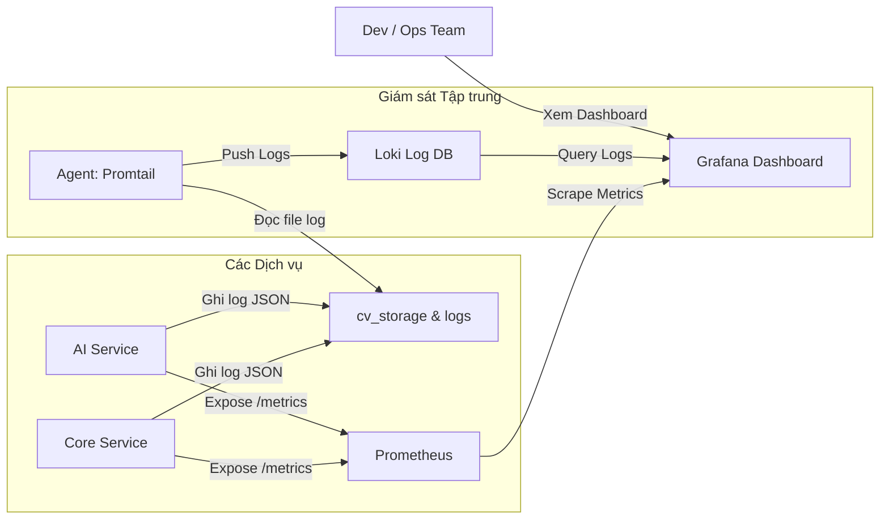

# PHẦN 3: BẢO MẬT & GIÁM SÁT (SECURITY & MONITORING)

Chào mừng các bạn dev! Khi hệ thống chuyển dịch từ một server Monolith sang mô hình phân tán Microservices, hai bài toán khó khăn nhất xuất hiện là:
1.  **Làm sao để bảo mật hệ thống?** (Không thể cấu hình bảo mật thủ công trên từng service, cần cơ chế quản lý token an toàn và tập trung).
2.  **Làm sao để giám sát và phát hiện lỗi?** (Nếu một request bị lỗi, làm sao để biết nó bị lỗi ở service nào trong số các service đang chạy ngầm mà không cần phải lục tung log của từng container).

Tài liệu này sẽ giải thích chi tiết giải pháp **Bảo mật** và **Giám sát tập trung** đã được triển khai trong hệ thống **AI HR Recruiter**.

---

## 1. Cơ Chế Bảo Mật Toàn Diện (Security Architecture)

Kiến trúc bảo mật của chúng ta được chia làm 3 lớp chính: Chốt chặn Gateway, Xác thực ứng dụng (Auth Service), và Phòng chống tấn công đặc thù.

### 1.1. Cơ chế xoay vòng Refresh Token (Refresh Token Rotation - RTR)
Để duy trì phiên đăng nhập cho HR mà không bắt họ phải nhập mật khẩu liên tục, chúng ta dùng **Access Token** ngắn hạn (hết hạn sau 15 phút) và **Refresh Token** dài hạn (hết hạn sau 7 ngày).

Tuy nhiên, nếu hacker lấy trộm được Refresh Token, chúng có thể âm thầm tạo ra các Access Token mới để truy cập hệ thống trái phép. Để giải quyết, chúng ta sử dụng cơ chế **Xoay vòng Refresh Token (RTR)**:
- Mỗi khi client gửi Refresh Token cũ lên để đổi lấy Access Token mới, **Refresh Token cũ đó sẽ lập tức bị xóa bỏ/thu hồi khỏi Database**.
- Đồng thời, server sẽ trả về một **Refresh Token hoàn toàn mới** cùng Access Token mới.

#### Mã nguồn thực hiện RTR trong `authService.ts`:
```typescript
// File: core-service/src/services/authService.ts

export const authService = {
  async refresh(refreshToken: string, correlationId: string) {
    // 1. Tìm thông tin Refresh Token trong DB
    const record = await refreshTokenRepository.findByToken(refreshToken);

    if (!record) {
      throw new AppError(401, 'REFRESH_TOKEN_INVALID', 'Refresh token không tồn tại hoặc đã bị thu hồi.');
    }

    // 2. Nếu token đã hết hạn, xóa luôn và yêu cầu đăng nhập lại
    if (record.expiresAt < new Date()) {
      await refreshTokenRepository.deleteByToken(refreshToken);
      throw new AppError(401, 'REFRESH_TOKEN_EXPIRED', 'Refresh token đã hết hạn. Vui lòng đăng nhập lại.');
    }

    // 3. XOAY VÒNG: Xóa ngay lập tức token cũ để ngăn chặn việc sử dụng lại (Replay Attack)
    await refreshTokenRepository.deleteByToken(refreshToken);

    // 4. Tạo cặp Access Token và Refresh Token mới tinh
    const newAccessToken = generateAccessToken({
      sub: record.user.id,
      email: record.user.email,
      role: 'HR',
    });

    const newRawRefreshToken = generateRefreshToken(); // Tạo UUID v4 mới
    const expiresAt = new Date(Date.now() + config.jwt.refreshTokenExpiryMs);

    // 5. Lưu Refresh Token mới vào DB
    await refreshTokenRepository.create({
      token: newRawRefreshToken,
      user: { connect: { id: record.user.id } },
      expiresAt,
    });

    logger.info({
      event: 'auth.refresh',
      correlation_id: correlationId,
      userId: record.user.id,
    });

    return {
      accessToken: newAccessToken,
      refreshToken: newRawRefreshToken,
    };
  }
}
```

### 1.2. Phòng chống tấn công dò mật khẩu (Brute Force Lockout & Timing Attacks)
*   **Brute Force Lockout (Khóa tài khoản):** Trong file `authService.ts`, chúng ta xây dựng bộ theo dõi `lockoutStore`. Nếu một tài khoản HR đăng nhập sai quá **5 lần liên tiếp**, hệ thống tự động khóa tài khoản đó trong **15 phút**.
*   **Timing Attack Prevention (Chống tấn công đo lường thời gian):** Kẻ tấn công có thể gửi các request đăng nhập với email ngẫu nhiên để đo thời gian phản hồi của API. Nếu email có tồn tại, thời gian so khớp hash mật khẩu (bằng `bcrypt.compare`) sẽ lâu hơn đáng kể so với email không tồn tại (chỉ cần truy vấn DB rồi trả về ngay). Trong code của chúng ta, **ngay cả khi email không tồn tại trong DB, chúng ta vẫn chạy hàm so sánh giả lập với thời gian tương đương** để hacker không thể đoán biết email nào có thật trên hệ thống.

```typescript
// Dù có tìm thấy user hay không, hàm bcrypt.compare vẫn được chạy để giữ thời gian phản hồi ổn định
const passwordMatch = user && (await bcrypt.compare(password, user.passwordHash));
```

### 1.3. Cấu hình bảo mật tại API Gateway (Nginx)
API Gateway của chúng ta bổ sung các HTTP Header bảo mật tiêu chuẩn để bảo vệ trình duyệt của HR:
*   `X-Frame-Options "DENY"`: Ngăn chặn Clickjacking (không cho phép nhúng website vào thẻ iframe trên web lạ).
*   `X-Content-Type-Options "nosniff"`: Chặn tấn công MIME-sniffing (buộc trình duyệt tuân thủ định dạng file trả về từ server).
*   `Strict-Transport-Security (HSTS)`: Buộc mọi kết nối từ client phải chạy qua HTTPS.
*   **Rate Limiting:** Chỉ cho phép tối đa **100 requests/phút** từ mỗi IP nhằm ngăn chặn spam API và tấn công từ chối dịch vụ (DDoS).

---

## 2. Hệ Thống Giám Sát và Cảnh Báo (Observability Stack)

Hạ tầng giám sát của hệ thống sử dụng bộ công cụ nổi tiếng trong giới Microservices: **Prometheus, Grafana, Loki và Promtail**.



### 2.1. Prometheus & Grafana - Thu thập số liệu (Metrics)
Prometheus sử dụng cơ chế **Pull-based** để tự động "kéo" dữ liệu số liệu từ endpoint `/metrics` của các service sau mỗi 15 giây.

Chúng ta viết một Middleware đo lường và đăng ký nó trên toàn bộ các route của ứng dụng (trừ chính endpoint `/metrics` và `/health` để tránh tạo rác dữ liệu):

```typescript
// File: core-service/src/middlewares/metrics.ts

import client from 'prom-client';

// 1. Đo tổng số lượng HTTP request đi qua hệ thống
export const httpRequestCounter = new client.Counter({
  name: 'http_requests_total',
  help: 'Tổng số lượng HTTP requests',
  labelNames: ['method', 'route', 'status', 'service'],
});

// 2. Đo thời gian phản hồi của API (độ trễ - Latency)
export const httpRequestDuration = new client.Histogram({
  name: 'http_request_duration_seconds',
  help: 'Thời gian xử lý HTTP request bằng giây',
  labelNames: ['method', 'route', 'status', 'service'],
  buckets: [0.05, 0.1, 0.3, 0.5, 1, 2, 5, 10], // Các cột mốc thời gian cần đo
});

export const metricsMiddleware = (req: Request, res: Response, next: NextFunction) => {
  const start = process.hrtime();

  res.on('finish', () => {
    const diff = process.hrtime(start);
    const duration = diff[0] + diff[1] / 1e9; // Đổi sang giây

    if (req.path !== '/metrics' && req.path !== '/health') {
      const route = req.route ? req.route.path : req.path;
      const status = res.statusCode.toString();
      const method = req.method;

      // Tăng bộ đếm và ghi nhận thời gian
      httpRequestCounter.inc({ method, route, status, service: 'core-service' });
      httpRequestDuration.observe({ method, route, status, service: 'core-service' }, duration);
    }
  });

  next();
};
```

Khi kết nối Prometheus vào **Grafana**, ta có thể dễ dàng thiết lập biểu đồ hiển thị thời gian phản hồi trung bình (P99 Latency), tỷ lệ lỗi 5xx, và tổng lượng request theo thời gian thực.

### 2.2. Ghi Log Tập Trung với Loki & Promtail
Trong môi trường microservices, các container ghi log ra console hoặc các file log riêng lẻ nằm phân tán trong Docker volumes.

Để xử lý bài toán này:
1.  Mọi service đều ghi log ra file dạng **JSON có cấu trúc** chung dưới thư mục chia sẻ `/var/log/app/*.log`.
2.  **Promtail** (một agent gọn nhẹ) chạy ngầm, liên tục đọc file log này và chuyển đổi các trường dữ liệu JSON thành các nhãn (Labels) tìm kiếm.
3.  Promtail đẩy toàn bộ log về **Loki** để lưu trữ.

#### Cấu hình Promtail bóc tách log JSON:
```yaml
# File: monitoring/promtail/promtail-config.yml

scrape_configs:
  - job_name: app-logs
    static_configs:
      - targets:
          - localhost
        labels:
          job: app-logs
          __path__: /var/log/app/*.log # Đường dẫn đọc file log chung
    pipeline_stages:
      # Phân tích cú pháp JSON để tự động bóc tách các trường làm nhãn tìm kiếm
      - json:
          expressions:
            timestamp: timestamp
            level: level
            service: service
            correlation_id: correlation_id
            event: event
      - timestamp:
          source: timestamp
          format: RFC3339
      - labels:
          level:
          service:
          correlation_id: # Nhãn tìm kiếm cực kỳ quan trọng
```

### 2.3. Sức mạnh của Correlation ID trong vận hành
Nhờ cấu hình Promtail ở trên, trường `correlation_id` đã trở thành một nhãn chỉ mục trong Loki. 

Khi HR báo cáo một lỗi (ví dụ: upload CV thành công nhưng không thấy gửi thư mời phỏng vấn), Dev chỉ cần lấy `correlation_id` của request lỗi đó và chạy câu truy vấn trên Grafana:

```logql
{job="app-logs"} |= "req-abc-123-xyz"
```

Loki sẽ lập tức lọc ra toàn bộ hành trình của request này đi qua:
- `core-service` (lưu file CV và gửi sự kiện đi).
- `rag-service` (nhận sự kiện, phân tích PDF và lưu vector).
- `core-service` (nhận sự kiện hoàn thành).

Toàn bộ các bước được hiển thị theo đúng thứ tự thời gian trên một màn hình duy nhất, giúp việc cô lập và sửa lỗi diễn ra chỉ trong vài giây thay vì vài giờ!

---

## 3. Tóm tắt & Bài học kinh nghiệm cho Web Developer

1.  **JWT Access Token luôn đặt thời gian sống ngắn:** Đừng đặt access token kéo dài nhiều ngày. Hãy dùng access token 15 phút kết hợp cơ chế xoay vòng Refresh Token (RTR) để tối ưu tính bảo mật.
2.  **Cấu hình Rate Limit cho từng nhóm IP:** Hãy chắc chắn bạn giới hạn tốc độ truy cập API để tránh tình trạng hệ thống bị spam gây cạn kiệt tài nguyên gọi API LLM (Gemini).
3.  **Tập trung ghi log dạng cấu trúc (Structured Logging):** Hãy từ bỏ thói quen dùng `console.log("đã chạy tới đây")`. Sử dụng logger ghi log định dạng JSON với đầy đủ thông tin `event`, `service`, và `correlation_id` để Loki có thể phân tích hiệu quả nhất.
